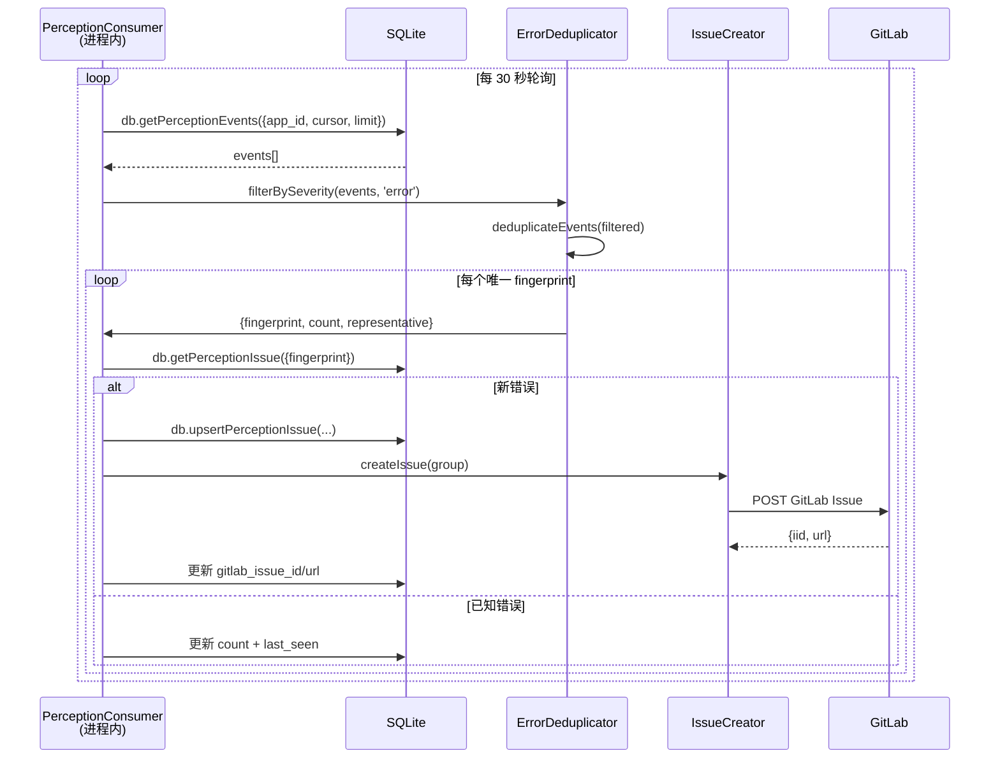

# Agent Channel 架构概览

---

## 系统定位

Agent Channel 是 ClawMark 的 AI Agent 接入层，让外部 Agent 能够：
1. **感知（Perception）** — 接收浏览器端实时错误、网络异常、性能数据
2. **分析（Analysis）** — 去重、聚合、自动创建 Issue
3. **行动（Action）** — （Phase 3+）通过 CDP 执行页面操作

---

## 数据流全景图

```mermaid
flowchart LR
    subgraph 浏览器["Chrome 浏览器"]
        CS_ERR["ErrorMonitor<br/>content script"]
        CS_CON["ConsoleProxy<br/>content script"]
        CS_NET["NetworkMonitor<br/>content script"]
        SW["Service Worker<br/>(background)"]
        PS["PerceptionStorage<br/>(chrome.storage)"]
    end

    subgraph 服务端["ClawMark Server"]
        API["REST API<br/>/agent-channel/*"]
        DB["SQLite<br/>perception_events"]
        ISS["perception_issues"]
    end

    subgraph Agent["内置 Agent 消费者（进程内）"]
        PC["PerceptionConsumer<br/>(定时轮询 DB)"]
        DD["ErrorDeduplicator<br/>(去重)"]
        IC["IssueCreator<br/>(建 Issue)"]
    end

    EA["外部 Agent<br/>(HTTP 轮询)"]
    GL["GitLab"]

    CS_ERR -->|PerceptionEvent| SW
    CS_CON -->|PerceptionEvent| SW
    CS_NET -->|PerceptionEvent| SW
    SW -->|存储| PS
    SW -->|POST /perception| API
    API -->|写入| DB

    PC -->|db.getPerceptionEvents()| DB
    PC --> DD
    DD -->|唯一错误| IC
    IC -->|创建 Issue| GL
    PC -->|db.upsertPerceptionIssue()| ISS

    EA -->|GET /perception| API
    API -->|events| EA
```

---

## 各层详解

### 1. 浏览器端（Content Scripts）

三个 content script 并行运行，各负责一个感知通道：

| Content Script | 捕获内容 | 事件类型 |
|----------------|----------|----------|
| **ErrorMonitor** | window.onerror / unhandledrejection / console.error / 资源加载失败 / PerformanceObserver 长任务 | runtime-error, resource-error, long-task |
| **ConsoleProxy** | console.error / console.warn 拦截 | console-error, console-warning |
| **NetworkMonitor** | fetch/XHR 拦截：4xx/5xx / CORS / 超时 / DNS 失败 | network-error, slow-request |

**关键机制：**

- **指纹去重（客户端）** — 每个事件生成 fingerprint（`channel:summary` 前 200 字符），10 秒内相同指纹不重复上报
- **环形缓冲** — 每个 tab 最多保存 200 条事件（PerceptionStorage）
- **域名白名单** — 只在配置的 allowed domains 上采集
- **敏感数据过滤** — 自动剥离 token、password、API key 等

### 2. Service Worker（Background）

- 接收 content script 的 `PERCEPTION_EVENT` 消息
- 写入 `chrome.storage.local`（PerceptionStorage，`perception_${tabId}` key）
- 通过 `POST /api/v2/agent-channel/perception` 上报到服务端
- Tab 关闭时自动清理对应数据

### 3. 服务端 REST API

所有端点在 `/api/v2/agent-channel/` 下：

| 路径 | 方法 | 认证 | 说明 |
|------|------|------|------|
| `/register` | POST | JWT | 注册新 Agent，获取 API Key |
| `/agents` | GET | JWT | 列出所有 Agent |
| `/agents/:id` | GET/PUT/DELETE | JWT | Agent CRUD |
| `/agents/:id/rotate-key` | POST | JWT | 轮转 API Key |
| `/perception` | POST | JWT/Agent Key | 上报感知事件 |
| `/perception` | GET | JWT/Agent Key | 查询事件（支持游标分页） |
| `/perception/stats` | GET | JWT/Agent Key | 聚合统计 |
| `/perception/issues` | GET/POST | JWT/Agent Key | 追踪 Issue CRUD |

**数据验证 & 限制：**
- 单次上报最多 100 个事件
- message 最长 4096 字符，stack 最长 8192，source/url 最长 2048
- 缺少 fingerprint 的事件被过滤
- app_id 隔离：每个 Agent 只能访问自己所属 App 的数据

### 4. Agent 消费者（PerceptionConsumer）

PerceptionConsumer 作为 **进程内模块** 运行在 ClawMark Server 中，直接访问 SQLite 数据库，不经过 HTTP API。

> **注意区分：** PerceptionConsumer 是内置消费者，直接调 `db.getPerceptionEvents()`。HTTP API（`GET /perception`）是给**外部 Agent** 用的拉取接口。两者数据源相同但访问方式不同。



**去重算法（ErrorDeduplicator）:**

1. **指纹生成** — `SHA256(type + normalizeMessage(msg) + normalizeStack(stack))`，取前 16 字符
2. **消息归一化** — URL → `<URL>`，hex ID → `<HEX>`，数字 → `N`
3. **调用栈归一化** — 取前 3 帧，剥离行/列号和域名
4. **严重级别过滤** — 支持 critical > error > warning > info 阈值

---

## 事件 Schema（PerceptionEvent）

```typescript
interface PerceptionEvent {
  // 核心字段
  type: 'runtime-error' | 'network-error' | 'console-error' |
        'console-warning' | 'slow-request' | 'resource-error' | 'long-task';
  message: string;          // 错误消息（max 4096）
  severity: 'critical' | 'error' | 'warning' | 'info';
  fingerprint: string;      // 去重指纹

  // 位置信息
  url: string;              // 发生页面 URL（max 2048）
  source: string;           // 来源文件（max 2048）
  line: number | null;      // 行号

  // 调试信息
  stack: string | null;     // 调用栈（max 8192）
  context: object;          // 自定义上下文

  // 元数据（服务端填充）
  id: string;               // 事件 ID
  app_id: string;           // 所属 App
  created_at: string;       // ISO8601 时间戳
}
```

---

## 安全设计

| 层 | 措施 |
|----|------|
| 扩展端 | 域名白名单、敏感数据过滤（token/password/key）、环形缓冲防内存溢出 |
| 传输层 | Agent Key SHA-256 哈希存储（服务端不保存明文）、key 前缀用于识别 |
| API 层 | app_id 隔离、频率限制（读/写/注册分别限速）、输入长度截断 |
| Agent 层 | Agent Key 仅创建时返回一次、支持 rotate 轮转 |
