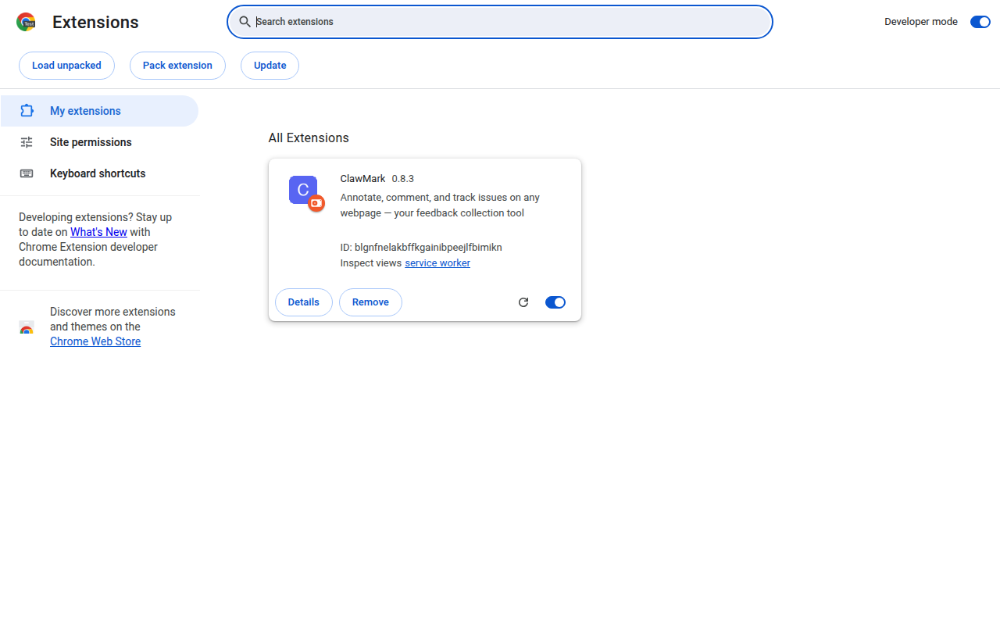
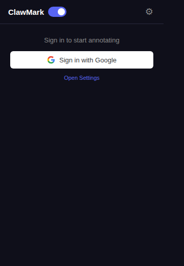
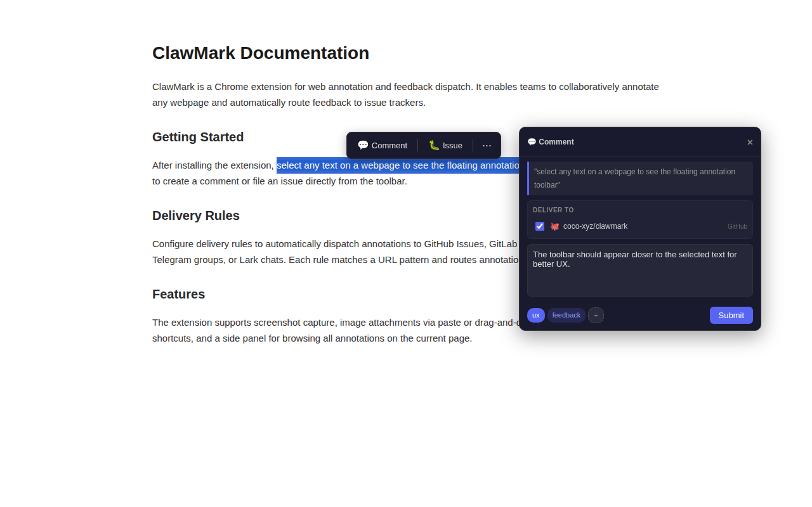
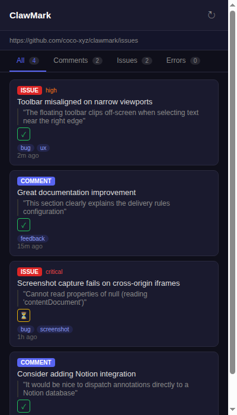
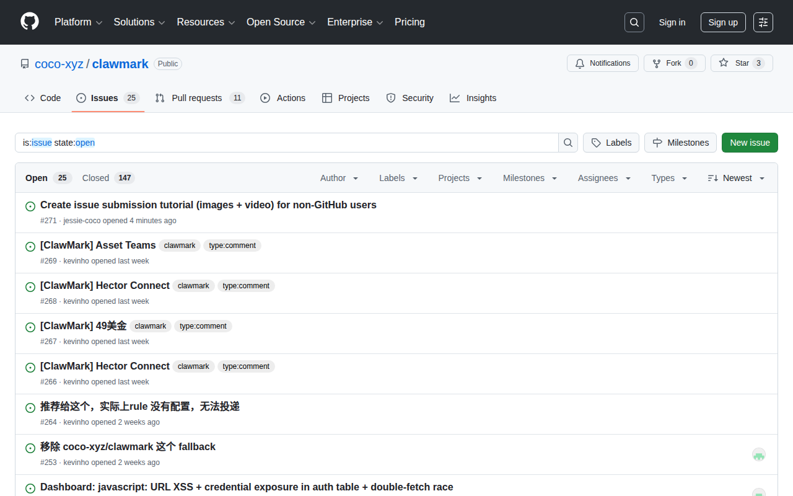
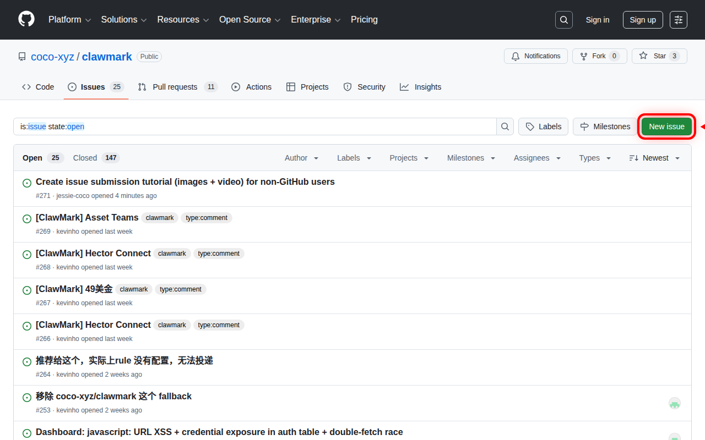
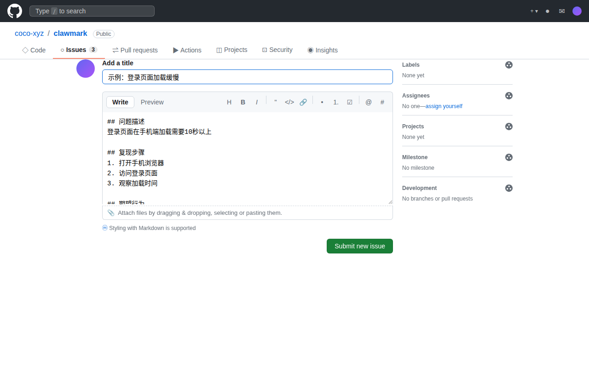

# ClawMark 完整使用教程

> ClawMark 是一个网页标注与反馈分发工具。本教程覆盖所有提交方式和投递渠道，帮助用户和管理员快速上手。

---

## 目录

**提交方式（用户）**
- [方式一：浏览器扩展（推荐）](#方式一浏览器扩展推荐)
- [方式二：REST API（程序化接入）](#方式二rest-api程序化接入)
- [方式三：嵌入式 Widget（即将推出）](#方式三嵌入式-widget即将推出)

**投递渠道配置（管理员）**
- [Dashboard 统一配置入口](#dashboard-统一配置入口)
- [渠道 1：GitHub Issues](#渠道-1github-issues)
- [渠道 2：GitLab Issues](#渠道-2gitlab-issues)
- [渠道 3：Lark / 飞书](#渠道-3lark--飞书)
- [渠道 4：Telegram](#渠道-4telegram)
- [渠道 5：Slack](#渠道-5slack)
- [渠道 6：Email（邮件）](#渠道-6email邮件)
- [渠道 7：Jira Cloud](#渠道-7jira-cloud)
- [渠道 8：Linear](#渠道-8linear)
- [渠道 9：通用 Webhook](#渠道-9通用-webhook)
- [渠道 10：HxA Connect](#渠道-10hxa-connect)

**智能路由**
- [路由规则配置](#路由规则配置)

**附录**
- [非 GitHub 用户：如何在 GitHub 上提交 Issue](#附录非-github-用户如何在-github-上提交-issue)
- [常见问题](#常见问题)

---

## 方式一：浏览器扩展（推荐）

ClawMark 浏览器扩展是最便捷的反馈方式——在任何网页上选中文字或截图，一键提交。

### 1.1 安装扩展

1. 打开 Chrome 浏览器，地址栏输入 `chrome://extensions/`
2. 打开右上角的 **开发者模式** 开关
3. 点击 **加载已解压的扩展程序**
4. 选择 ClawMark 仓库中的 `extension/` 文件夹



> **提示：** 安装后，工具栏会出现 ClawMark 图标。建议点击拼图图标 📌 固定到工具栏。

### 1.2 配置连接

1. 点击工具栏的 ClawMark 图标，打开弹窗
2. 填写 **Server URL**（服务器地址），例如 `https://labs.coco.xyz/clawmark`
3. 使用 Google 账号登录，或输入 API Key



### 1.3 提交反馈

#### 方法 A：选中文字提交

1. 在任意网页上选中一段文字
2. 弹出的浮动工具栏上选择操作：
   - 💬 **评论** — 一般性评论
   - 🐛 **Issue** — 报告问题
   - 📸 **截图** — 截图标注
3. 在弹出的输入框中填写：
   - **标题**：简述问题（如"登录按钮点击无反应"）
   - **内容**：详细描述
   - **优先级**：低 / 普通 / 高 / 紧急
   - **标签**：可选，分类用
4. 点击 **提交**



#### 方法 B：截图提交

1. 右键点击页面 → 选择 **ClawMark** → **截图并反馈**
2. 框选需要截图的区域
3. 可在截图上添加标注
4. 填写描述后提交

#### 方法 C：侧边栏查看与管理

1. 点击 ClawMark 图标打开侧边栏
2. 查看当前页面的所有标注和反馈
3. 可以回复、修改状态（解决/关闭）



### 1.4 功能开关

- **全局开关**：在扩展弹窗中可一键启用/禁用
- **按站点禁用**：在特定网站上可单独关闭扩展

---

## 方式二：REST API（程序化接入）

适合自动化场景：CI/CD 集成、脚本批量提交、其他系统对接。

### 2.1 获取 API Key

1. 打开 ClawMark Dashboard（如 `https://labs.coco.xyz/clawmark/dashboard/`）
2. 登录后进入 **Settings** → **Auth**
3. 创建 API Key 或使用 Google OAuth 获取 JWT Token

### 2.2 创建反馈条目

**请求：**

```bash
curl -X POST https://your-server/clawmark/api/v2/items \
  -H "Authorization: Bearer YOUR_TOKEN" \
  -H "Content-Type: application/json" \
  -d '{
    "type": "issue",
    "title": "登录页面加载缓慢",
    "content": "首次加载需要 8 秒以上，影响用户体验",
    "source_url": "https://example.com/login",
    "source_title": "登录页面",
    "priority": "high",
    "tags": ["performance", "frontend"]
  }'
```

**参数说明：**

| 字段 | 必填 | 说明 |
|------|------|------|
| `type` | 否 | `issue`（报告问题）/ `comment`（评论）/ `discuss`（讨论），默认 `comment` |
| `title` | type=issue 时必填 | 标题 |
| `content` | 否 | 详细描述 |
| `source_url` | 否 | 来源页面 URL |
| `source_title` | 否 | 来源页面标题 |
| `quote` | 否 | 选中的文字 |
| `priority` | 否 | `critical` / `high` / `normal` / `low` |
| `tags` | 否 | 标签数组，如 `["bug", "ui"]` |
| `screenshots` | 否 | 截图 URL 数组 |
| `selected_targets` | 否 | 指定投递渠道（覆盖路由规则） |

**返回：** 创建的条目详情 + 投递状态摘要。

### 2.3 其他常用接口

| 接口 | 用途 |
|------|------|
| `GET /api/v2/items` | 获取条目列表（支持分页和过滤） |
| `PATCH /api/v2/items/:id` | 更新条目（修改状态、标题等） |
| `POST /api/v2/items/:id/resolve` | 标记为已解决 |
| `POST /api/v2/items/:id/close` | 关闭条目 |
| `POST /api/v2/routing/resolve` | 预览路由匹配结果（dry run） |

> 完整 API 文档见 `docs/api-reference.md`。

---

## 方式三：嵌入式 Widget（即将推出）

ClawMark 计划提供可嵌入任意网站的 JS Widget，让访客无需安装扩展也能直接在页面上提交反馈。

```html
<!-- 即将推出 -->
<script src="https://your-server/clawmark/widget.js"></script>
<script>
  ClawMark.init({ server: 'https://your-server/clawmark', apiKey: 'xxx' });
</script>
```

---

## Dashboard 统一配置入口

所有投递渠道通过 ClawMark Dashboard 配置：

1. 打开 Dashboard（如 `https://labs.coco.xyz/clawmark/dashboard/`）
2. 登录后进入 **Settings** 页面

配置分两步：
- **Step 1：添加凭证**（Auth 子页面）— 存储第三方平台的认证信息
- **Step 2：创建路由规则**（Delivery Rules 子页面）— 定义什么条件下投递到哪个渠道

> 凭证使用 AES-256-GCM 加密存储，服务端不会明文保存密码或 Token。

---

## 渠道 1：GitHub Issues

将反馈自动创建为 GitHub Issue。

### 配置凭证

在 Dashboard → Settings → Auth 中添加：

| 字段 | 值 |
|------|-----|
| **类型** | GitHub PAT |
| **名称** | 自定义（如 "my-github"） |
| **Token** | GitHub Personal Access Token（需 `repo` 权限） |

> **获取 Token：** GitHub → Settings → Developer settings → Personal access tokens → Generate new token → 勾选 `repo` 权限。

### 配置路由规则

在 Dashboard → Settings → Delivery Rules 中添加：

| 字段 | 值 |
|------|-----|
| **规则类型** | URL Pattern / Default |
| **URL Pattern** | 如 `*github.com/myorg/*` |
| **目标类型** | GitHub Issue |
| **仓库** | `owner/repo` 格式（如 `coco-xyz/clawmark`） |
| **Labels** | 可选，如 `bug,clawmark` |
| **Assignees** | 可选，GitHub 用户名 |
| **凭证** | 选择上面创建的凭证 |

### 效果

提交反馈后，自动在指定仓库创建 Issue，包含：标题、描述、截图、来源 URL、优先级标签。Issue 解决/关闭时会同步状态。

---

## 渠道 2：GitLab Issues

将反馈自动创建为 GitLab Issue。支持自建 GitLab 实例。

### 配置凭证

| 字段 | 值 |
|------|-----|
| **类型** | GitLab PAT |
| **Token** | GitLab Personal Access Token（需 `api` 权限） |

> **获取 Token：** GitLab → User Settings → Access Tokens → 勾选 `api` scope。

### 配置路由规则

| 字段 | 值 |
|------|-----|
| **目标类型** | GitLab Issue |
| **Project ID** | 项目路径（如 `hxanet/clawmark`）或数字 ID |
| **Base URL** | 默认 `https://gitlab.com`，自建实例填实际地址 |
| **Labels** | 可选 |

---

## 渠道 3：Lark / 飞书

将反馈以卡片消息推送到飞书群。

### 配置凭证

| 字段 | 值 |
|------|-----|
| **类型** | Lark Webhook |
| **Webhook URL** | 飞书群机器人的 Webhook 地址 |
| **Secret** | 可选，签名校验密钥 |

> **获取 Webhook：** 飞书群 → 设置 → 群机器人 → 添加自定义机器人 → 复制 Webhook URL。

### 效果

反馈提交后，群内收到交互式卡片消息，包含：
- 标题、优先级（颜色标记）
- 来源 URL 链接
- 操作按钮（查看详情、分配、解决）

---

## 渠道 4：Telegram

将反馈推送到 Telegram 群组或频道。

### 配置凭证

| 字段 | 值 |
|------|-----|
| **类型** | Telegram Bot |
| **Bot Token** | Telegram Bot API Token |
| **Chat ID** | 目标群组/频道 ID |

> **获取方式：**
> 1. 在 Telegram 找 [@BotFather](https://t.me/BotFather)，发送 `/newbot`，按提示创建 Bot，获取 Token
> 2. 将 Bot 添加到目标群组
> 3. 获取 Chat ID：访问 `https://api.telegram.org/bot<TOKEN>/getUpdates`，找到 `chat.id` 字段（群组 ID 为负数）

### 效果

反馈提交后，群内收到格式化消息，包含优先级 emoji、标题、来源链接。

> **注意：** Telegram 渠道是**单向推送通知**，不支持在 TG 群内直接回复。要回复请点击消息中的链接。

---

## 渠道 5：Slack

将反馈推送到 Slack 频道。

### 配置凭证

| 字段 | 值 |
|------|-----|
| **类型** | Slack Webhook |
| **Webhook URL** | Slack Incoming Webhook URL |
| **Channel** | 可选，覆盖默认频道 |

> **获取 Webhook：** Slack App → Incoming Webhooks → Add New Webhook to Workspace → 选择频道 → 复制 URL。

### 效果

反馈以 Block Kit 富消息格式推送，支持线程回复。

---

## 渠道 6：Email（邮件）

将反馈通过邮件发送给指定收件人。支持 Resend 和 SendGrid 两种服务商。

### 配置凭证

| 字段 | 值 |
|------|-----|
| **类型** | Email API |
| **API Key** | Resend 或 SendGrid 的 API Key |
| **Provider** | `resend`（默认）或 `sendgrid` |
| **From** | 发件人邮箱地址 |
| **To** | 收件人邮箱（多个用逗号分隔） |
| **Subject Prefix** | 可选，邮件标题前缀（默认 `[ClawMark]`） |

> **获取 API Key：**
> - Resend：[resend.com](https://resend.com) → API Keys
> - SendGrid：[sendgrid.com](https://sendgrid.com) → Settings → API Keys

---

## 渠道 7：Jira Cloud

将反馈创建为 Jira Issue。

### 配置凭证

| 字段 | 值 |
|------|-----|
| **类型** | Jira API |
| **Email** | Jira 账号邮箱 |
| **API Token** | Jira Cloud API Token |
| **Domain** | Jira 子域名（如 `myteam`，完整为 `myteam.atlassian.net`） |
| **Project Key** | 项目代号（如 `PROJ`） |
| **Issue Type** | 可选，默认 `Task` |

> **获取 API Token：** [id.atlassian.com/manage-profile/security/api-tokens](https://id.atlassian.com/manage-profile/security/api-tokens)

### 效果

反馈自动创建为 Jira Issue，解决/关闭时同步状态。

---

## 渠道 8：Linear

将反馈创建为 Linear Issue。

### 配置凭证

| 字段 | 值 |
|------|-----|
| **类型** | Linear API |
| **API Key** | Linear API Key |
| **Team ID** | 目标团队 UUID |
| **Labels** | 可选，标签名数组 |
| **Assignee ID** | 可选，默认负责人 UUID |
| **Priority** | 可选，0=无 / 1=紧急 / 2=高 / 3=中 / 4=低 |

> **获取 API Key：** Linear → Settings → API → Create Key

---

## 渠道 9：通用 Webhook

将反馈以 JSON 格式 POST 到任意 HTTPS 端点。适合对接自定义系统。

### 配置凭证

| 字段 | 值 |
|------|-----|
| **类型** | Webhook Secret（可选） |
| **URL** | 目标 HTTPS 地址 |
| **Secret** | 可选，用于 HMAC-SHA256 签名校验 |

### Payload 格式

```json
{
  "event": "item.created",
  "payload": { /* 完整条目对象 */ },
  "context": { /* 附加上下文 */ },
  "timestamp": "2026-03-22T10:00:00.000Z"
}
```

设置 Secret 后，请求头会带 `X-ClawMark-Signature: sha256=<hmac>` 用于验签。

> **安全说明：** 内置 SSRF 防护，不允许请求私有 IP 地址。超时 10 秒。

---

## 渠道 10：HxA Connect

将反馈推送到 HxA Connect 消息总线。

### 配置凭证

| 字段 | 值 |
|------|-----|
| **类型** | HxA API |
| **Hub URL** | HxA Connect 服务地址 |
| **Agent ID** | 目标 Agent UUID |
| **API Key** | 可选，认证密钥 |
| **Thread ID** | 可选，指定回复线程 |

---

## 路由规则配置

路由规则决定反馈提交后投递到哪些渠道。支持多渠道并行投递。

### 规则类型

| 类型 | 说明 | 示例 |
|------|------|------|
| **URL Pattern** | 按来源页面 URL 匹配（glob 语法） | `*github.com/myorg/*` |
| **Content Type** | 按反馈类型匹配 | `issue` / `comment` / `discuss` |
| **Tag Match** | 按标签匹配 | `bug` |
| **Default** | 无其他规则匹配时的兜底 | — |

### 匹配优先级（从高到低）

1. **Target Declaration** — 页面通过 meta 标签声明的目标
2. **User Rules** — 用户在 Dashboard 配置的规则
3. **GitHub Auto-detect** — 自动检测 GitHub 仓库 URL
4. **User Default** — 用户设置的默认投递目标
5. **System Default** — 系统全局默认

### 配置步骤

1. 进入 Dashboard → Settings → Delivery Rules
2. 点击 **Add Rule**
3. 选择规则类型和匹配条件
4. 选择目标渠道类型，填写配置
5. 选择关联的凭证
6. 保存并启用

> 一条反馈可以同时匹配多条规则，实现多渠道并行投递。

---

## 附录：非 GitHub 用户如何在 GitHub 上提交 Issue

如果你不方便安装扩展，也可以直接在 GitHub 网页上提交。

### 1. 注册 GitHub 账号

1. 访问 [github.com](https://github.com)，点击 **Sign up**
2. 按提示输入邮箱、密码、用户名


### 2. 打开 Issues 页面

登录后，访问：
```
https://github.com/coco-xyz/clawmark/issues
```



### 3. 创建 Issue

点击绿色的 **New issue** 按钮：



填写内容：

**标题** — 一句话描述，例如：
- "登录页面加载缓慢"
- "消息发送失败"
- "[建议] 增加深色模式"

**描述** — 建议使用模板：

```markdown
## 问题描述
简要说明遇到的问题。

## 复现步骤
1. 第一步
2. 第二步
3. 出现问题

## 期望行为
描述期望的正确结果。

## 环境信息
- 设备：手机/电脑
- 浏览器：Chrome/Safari
- 系统：iOS/Android/Windows/Mac
```



### 4. 添加截图

截图能帮助开发者快速定位问题：

- **拖拽上传**：将截图文件拖入描述框
- **粘贴上传**：截图后按 Ctrl+V（Mac 按 Cmd+V）
- **点击上传**：点击输入框下方的上传链接

> 上传后会显示 `` 代码，提交后会显示为图片。

### 5. 提交

- 可选：在右侧选择标签（`bug` / `enhancement` / `question`）
- 确认内容无误后点击 **Submit new issue**

> ⚠️ 提交后内容公开可见，请勿包含密码等敏感信息。

### 6. 跟踪状态

| 状态 | 含义 |
|------|------|
| **Open** (绿色) | 等待处理 |
| **Closed** (紫色) | 已解决/关闭 |

有回复或状态变更时会收到邮件通知。可随时在评论区补充信息。

---

## 常见问题

**Q: 推荐哪种提交方式？**
A: 日常使用推荐**浏览器扩展**，最方便；自动化集成用 **REST API**；不便安装扩展时用 **GitHub Issue**。

**Q: 不会英文，可以用中文写吗？**
A: 可以！团队支持中文反馈。

**Q: 提交后发现写错了怎么办？**
A: GitHub Issue 可点击编辑图标修改；扩展提交的内容可在侧边栏编辑。

**Q: Telegram/飞书群里收到了通知，怎么回复？**
A: 通知渠道是单向推送。要回复请点击通知中的链接跳转到原始 Issue。

**Q: 可以同时投递到多个渠道吗？**
A: 可以。创建多条路由规则，每条指向不同渠道，一条反馈可以同时投递到 GitHub + Telegram + 飞书等。

**Q: 凭证安全吗？**
A: 凭证使用 AES-256-GCM 加密存储在服务端，传输使用 HTTPS。服务端不会明文保存 Token。

---

*如有疑问，可在 Issue 中 @jessie-coco 或联系团队成员。*
